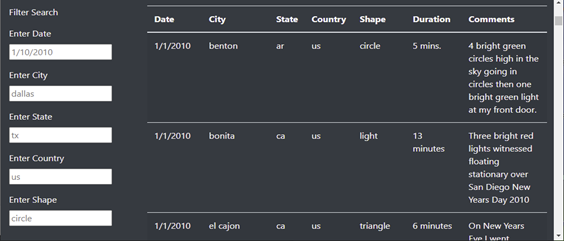

# Module_11_UFOs
UNC - Module 11

# UFO REPORTS

&nbsp;&nbsp;&nbsp;&nbsp;&nbsp;    

## Overview
There is considerable interest in signs of extraterrestrial visits to our planet and multiple unexplained sightings have been reported over the years. We have created a searchable table of some reported UFOs from different cities and countries.  

&nbsp;&nbsp;&nbsp;&nbsp;&nbsp;    

## Details
The table is searchable based on multiple criteria.  Sightings can be found based on date, city, state, country, and object shape.  Searches can be done by one or more values at a time.  The list below was based on a date and one state.

&nbsp;&nbsp;&nbsp;&nbsp;&nbsp;    

## Table Search Review
### Limitations

•	One hinderance to using the searches is that the person must know the value to search by in each field and how that value is in the field.  (Is Florida always "fl" or did someone enter it as "fr" instead?)  

•	It's unclear from viewing the screen how the search works.  It also wastes time and resources to search on each text box change.

### Recommendations

•	It would be helpful to change the text boxes to dropdown boxes with values based on lists from the data file.  That way, the user would always know what values could be used in a search.

•	Adding a couple of buttons to the screen would make it clearer how the table worked.  A button to filter the data after all the criteria was entered and a button to reset the filters back to blank would make it more user-friendly.

•	The ability to download the list would enable the user to keep a listing for further research.

